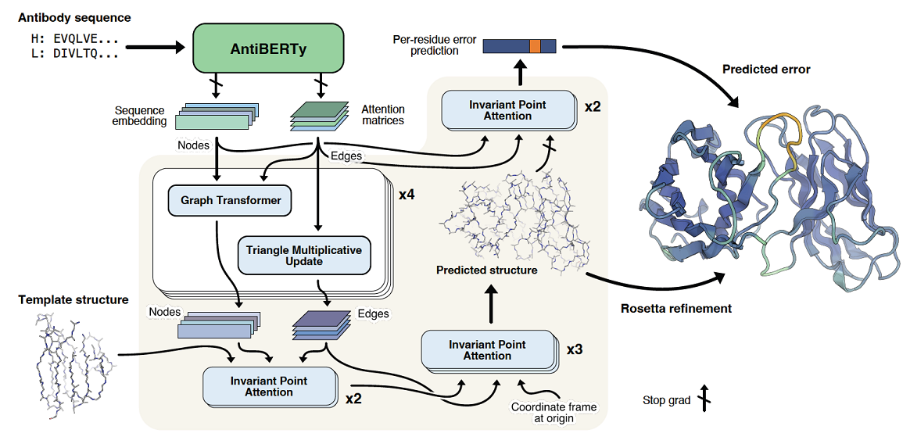

# igfold-pytorch



Re-implementation of IgFold, a fast antibody structure prediction method, in PyTorch. You can find the official implementation of IgFold [here](https://github.com/Graylab/IgFold/tree/main/igfold).

## Installation
```shell
$ pip install igfold-pytorch
```

## Citation
```bibtex
@article{ruffolo2022fast,
    title = {Fast, accurate antibody structure prediction from deep learning on massive set of natural antibodies},
    author = {Ruffolo, Jeffrey A and Chu, Lee-Shin and Mahajan, Sai Pooja and Gray, Jeffrey J},
    journal = {bioRxiv},
    year= {2022}
}
```
